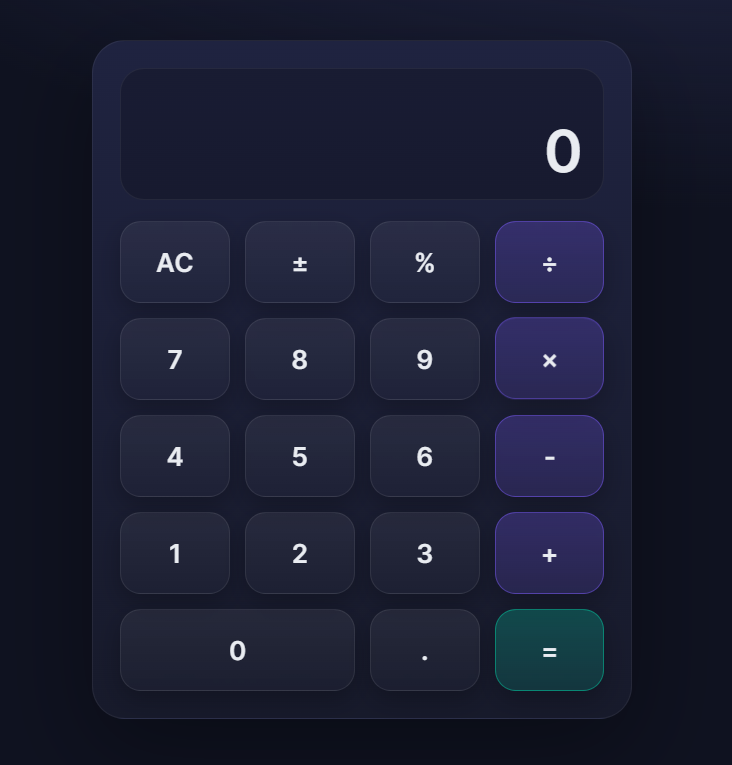

<<<<<<< HEAD
# React + Vite

This template provides a minimal setup to get React working in Vite with HMR and some ESLint rules.

Currently, two official plugins are available:

- [@vitejs/plugin-react](https://github.com/vitejs/vite-plugin-react/blob/main/packages/plugin-react) uses [Babel](https://babeljs.io/) for Fast Refresh
- [@vitejs/plugin-react-swc](https://github.com/vitejs/vite-plugin-react/blob/main/packages/plugin-react-swc) uses [SWC](https://swc.rs/) for Fast Refresh

## Expanding the ESLint configuration

If you are developing a production application, we recommend using TypeScript with type-aware lint rules enabled. Check out the [TS template](https://github.com/vitejs/vite/tree/main/packages/create-vite/template-react-ts) for information on how to integrate TypeScript and [`typescript-eslint`](https://typescript-eslint.io) in your project.
=======
# prankCalcApp
A simple React-based calculator with a funny prank feature. Includes basic operations and a hidden twist when you hit the "=" button.

# 🧮 Fun Calculator with a Twist  

A simple calculator built with **HTML, CSS & React**… but wait 👀, it has a little prank hidden inside 😈.  

---

## 🚀 Features  
- Basic calculator operations ➕ ➖ ✖️ ➗  
- Responsive UI (works on any device)  
- A funny “Hello World!” prank before showing results  
- Clean & minimal design  

---

## 🎥 Demo  
Here’s a sneak peek 👇  

 
*(add your own screenshot or gif here)*  

---

## ⚡ Tech Stack  
- **React.js**  
- **HTML5**  
- **CSS3**  

---

## ❓ Why this project?  
I wanted to practice **React basics** while keeping it fun.  
So I built a normal calculator… but gave it a **prank twist** to surprise users 😂.  

---

## 🛠️ Installation  
Clone the repo and run it locally:  

```bash
git clone https://github.com/your-username/calculator.git
cd calculator
npm install
npm start
>>>>>>> f4c018eed1b4a521096a80013f03d27a3efd706a
